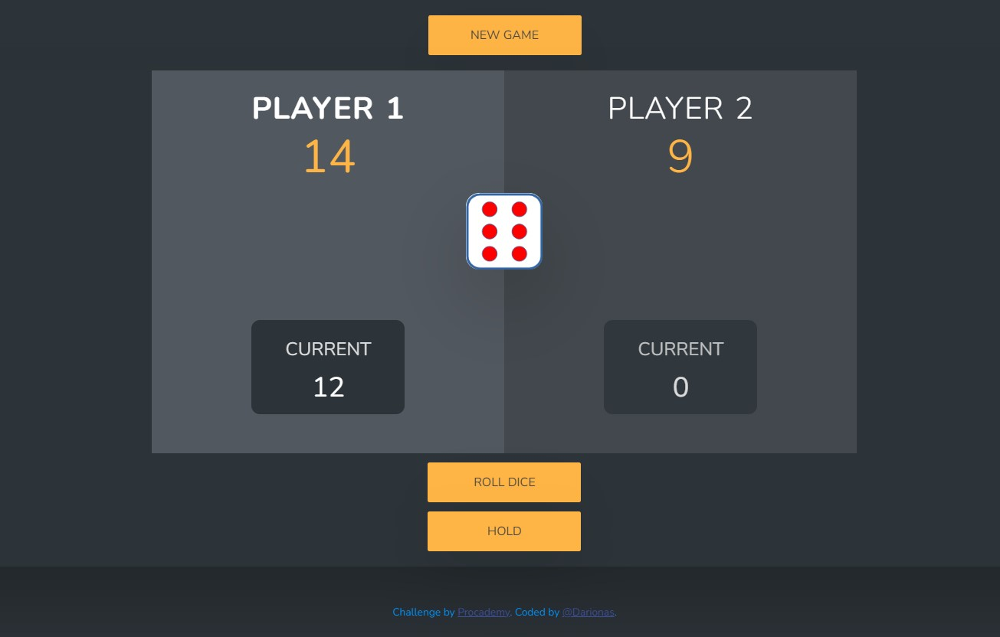

# Procademy - Pig Game challenge

This is a challenge of [Procademy](https://www.youtube.com/watch?v=WfC63i5LZXA&list=PL1BztTYDF-QMThfarnu3KvxVwiLKAFbsK).

## Table of contents

- [Overview](#overview)
  - [The challenge](#the-challenge)
  - [Screenshot](#screenshot)
  - [Links](#links)
- [My process](#my-process)
  - [Built with](#built-with)

## Overview

### About Pig Game

Pig is a simple dice game first described in print by John Scarne in 1945. 
Each turn, a player repeatedly rolls a die until either a 1 is rolled or the player decides to "hold":

- If the player rolls a 1, they score nothing and it becomes the next player's turn.
- If the player rolls any other number, it is added to their turn total and the player's turn continues.
- If a player chooses to "hold", their turn total is added to their score, and it becomes the next player's turn.

The first player to score 100 or more points wins.

### The challenge

Users should be able to:

- View the optimal layout depending on their device's screen size
- Interact all interactive elements on the page

### Screenshot

### Links

- Solution URL: (https://github.com/Darionas/Pig_game)
- Live Site URL: (https://darionas.github.io/Pig_game/)

## My process

* Set HTML layout:
* Create CSS external file to set style for HTML layout:
  * To achieve responsive web design set grid layout module:
     * Create first for mobile;
     * Later for desktop;
* Create external JavaScript file.

### Built with

It is based on:

- HTML
- CSS (grid layout module)
- JavaScript

But created with love.

